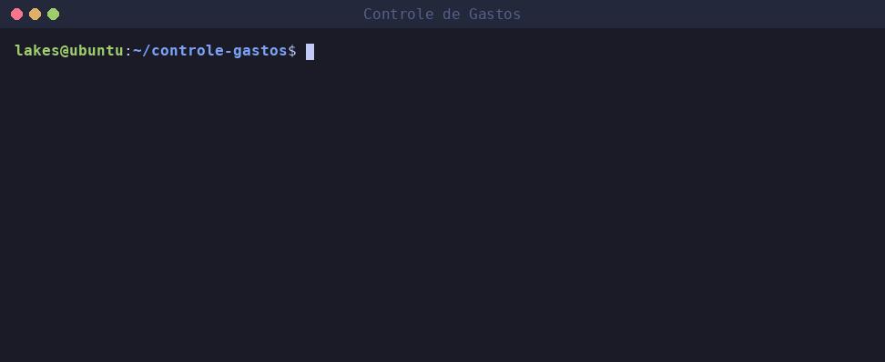
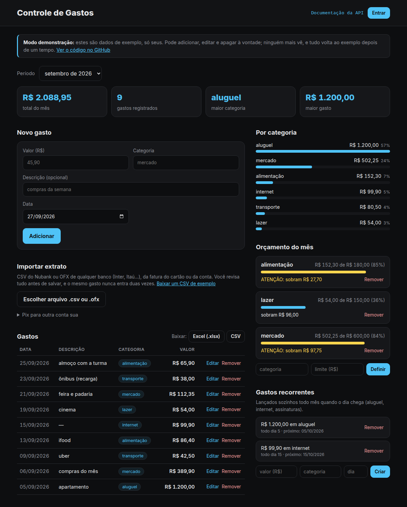

# Controle de Gastos

[](https://github.com/Lakes777/controle-gastos/actions/workflows/testes.yml)

Aplicativo para registrar e acompanhar gastos pessoais: na linha de comando, em Python puro, ou no navegador, com uma API em FastAPI.

**Ver ao vivo:** https://controle-gastos-lakes777.vercel.app (demonstração com dados de exemplo, só seus)



> Gravado com dados de exemplo.

```
$ python -m gastos resumo --mes 2026-09
alimentação       R$ 342,80
mercado           R$ 489,90
transporte        R$ 127,50
--------------------------
TOTAL             R$ 960,20
```

## Funcionalidades

- **Adicionar** gastos com valor, categoria, descrição e data
- **Listar** todos os gastos em ordem cronológica, cada um com seu número
- **Editar** um gasto pelo número, mudando só os campos informados
- **Remover** um gasto pelo número
- **Resumir** o total por categoria, com filtro por mês
- **Gráfico** de barras no terminal, por categoria ou por mês
- **Importar extratos:** CSV do Nubank ou **OFX de qualquer banco** (Inter, Itaú, Nubank...), da fatura do cartão ou da conta, com categoria adivinhada pela descrição, `--simular`, linhas que podem ser deixadas de fora e sem nunca importar o mesmo gasto duas vezes
- **Lembra a categoria de cada loja:** corrigiu "Paradojabar" para lazer uma vez, e as próximas compras lá já chegam como lazer na importação (a linha de comando marca com "categoria lembrada", a página com •)
- **Pix para outra conta sua não é gasto:** com o seu nome cadastrado, a transferência do Inter para o Nubank (por exemplo) só troca o dinheiro de lugar e fica de fora
- **Gastos recorrentes** (aluguel, internet, assinaturas), lançados sozinhos quando o dia chega, inclusive os meses em que o programa não foi aberto
- **Orçamento** mensal por categoria, com aviso de ATENÇÃO a partir de 80% e de ESTOUROU acima do limite, mostrado também ao adicionar ou editar um gasto
- **Exportar** para planilha do Excel (`.xlsx`) ou CSV, geral ou de um mês; o `.xlsx` sai com valores em R$, datas de verdade e linha de total com fórmula
- Aceita valores com vírgula (`45,90`) ou ponto (`45.90`)
- Valida o que o usuário digita (valores negativos, texto inválido e datas erradas são recusados)
- **Contas de usuário na versão online:** cadastro com código de convite, login com senha em argon2id, sessões que podem ser encerradas e exclusão da conta com todos os dados
- **Versão web** (FastAPI + HTML/CSS/JS): formulário, lista com editar/remover, gráfico por categoria, orçamento, recorrentes, importação de extratos com prévia e download do .xlsx, usando o mesmo banco do terminal
- Dados salvos localmente num banco SQLite, fora do controle de versão
- Quem usava a versão antiga (JSON) tem os gastos importados automaticamente

## Instalação

Requer **Python 3.10+**. A linha de comando não tem dependências externas; só a versão web precisa do FastAPI.

```bash
git clone https://github.com/Lakes777/controle-gastos.git
cd controle-gastos
```

## Como usar

```bash
# Adicionar um gasto (a descrição é opcional; a data padrão é hoje)
python -m gastos adicionar 45,90 mercado "compras da semana"
python -m gastos adicionar 12.50 transporte --data 2026-09-20

# Listar todos os gastos (com o número de cada um)
python -m gastos listar

# Editar o gasto número 2 (só muda o que for informado)
python -m gastos editar 2 --valor 25,00 --categoria transporte
python -m gastos editar 2 --descricao ""    # apaga a descrição

# Remover o gasto número 2
python -m gastos remover 2

# Resumo por categoria (geral ou de um mês)
python -m gastos resumo
python -m gastos resumo --mes 2026-09

# Gráfico de barras no terminal
python -m gastos grafico                   # por categoria, da maior para a menor
python -m gastos grafico --mes 2026-09     # só um mês
python -m gastos grafico --por mes         # evolução mês a mês

# Importar o extrato (fatura do cartão ou conta): CSV do Nubank ou OFX de qualquer banco
python -m gastos importar Nubank_2026-09.csv --simular   # só mostra o que entraria
python -m gastos importar Nubank_2026-09.csv
python -m gastos importar extrato-inter.ofx              # o formato é reconhecido pelo conteúdo
python -m gastos importar extrato-inter.ofx --pular 2,5  # deixa de fora as linhas 2 e 5 da lista

# Seu nome como aparece nos extratos: Pix enviado para ele é transferência entre contas suas
python -m gastos meu-nome adicionar "Ana Souza Lima"
python -m gastos meu-nome                                # lista os nomes
python -m gastos meu-nome remover "Ana Souza Lima"

# Gastos recorrentes: lançados sozinhos quando o dia chega
python -m gastos recorrente adicionar 1200 aluguel --dia 5
python -m gastos recorrente adicionar 39,90 internet --dia 31      # em mês curto, cai no último dia
python -m gastos recorrente adicionar 55,90 streaming --dia 10 --desde 2026-08   # inclui meses passados
python -m gastos recorrente                                        # lista, com o próximo lançamento
python -m gastos recorrente remover 1                              # para de lançar

# Orçamento mensal por categoria
python -m gastos orcamento definir mercado 500   # cria ou troca o limite
python -m gastos orcamento                       # situação do mês atual
python -m gastos orcamento --mes 2026-08         # de outro mês
python -m gastos orcamento remover mercado

# Exportar (o formato vem da extensão); não sobrescreve arquivo existente sem pedir
python -m gastos exportar gastos.xlsx                   # planilha do Excel
python -m gastos exportar setembro.xlsx --mes 2026-09
python -m gastos exportar gastos.csv                    # CSV com ; (Excel em português)
python -m gastos exportar gastos.xlsx --sobrescrever

# Ajuda
python -m gastos --help
```

Exemplo de listagem:

```
  Nº  DATA               VALOR  CATEGORIA     DESCRIÇÃO
   2  20/09/2026      R$ 12,50  transporte
   1  23/09/2026      R$ 45,90  mercado       compras da semana
```

Exemplo de gráfico:

```
Gastos por categoria

lanche  ██████████████████████████████       R$ 30,00   56%
uber    ███████████████████████▋             R$ 23,59   44%
TOTAL                                        R$ 53,59
```

Exemplo de importação do extrato da conta:

```
$ python -m gastos importar extrato.csv
Arquivo reconhecido: extrato da conta do Nubank (CSV)

  + 01/09/2026      R$ 45,90  mercado       Compra no débito - SUPERMERCADO CONDOR
  + 10/09/2026      R$ 18,50  alimentação   Compra no débito - PADARIA BELA VISTA
  - 02/09/2026   R$ 2.500,00  Pix recebido - EMPRESA (ignorado: entrada de dinheiro)
  - 05/09/2026   R$ 1.200,00  Pagamento de fatura (ignorado: pagamento da fatura; as compras vêm da fatura do cartão)

2 gasto(s) importado(s), 0 já importado(s) antes, 2 ignorado(s)
```

Quando chega o dia de um gasto recorrente, qualquer comando o lança e avisa:

```
$ python -m gastos listar
Lançado automaticamente: R$ 1.200,00 em aluguel (05/10/2026)
  Nº  DATA               VALOR  CATEGORIA     DESCRIÇÃO
   1  05/10/2026   R$ 1.200,00  aluguel       apartamento
```

Exemplo de orçamento:

```
Orçamento de set/2026

lazer            R$ 95,00 de R$ 80,00       119%  ██████████  ESTOUROU em R$ 15,00
mercado         R$ 420,00 de R$ 500,00       84%  ████████▍░  ATENÇÃO: sobram R$ 80,00
uber             R$ 10,00 de R$ 50,00        20%  ██░░░░░░░░  sobram R$ 40,00
```

Com orçamento definido, adicionar ou editar um gasto já mostra como ficou o mês:

```
$ python -m gastos adicionar 120 mercado
Gasto adicionado: R$ 120,00 em mercado
Orçamento de mercado em set/2026: R$ 420,00 de R$ 500,00 (84%) - ATENÇÃO: sobram R$ 80,00
```

## Versão web



> Print com dados de exemplo.

```bash
python -m venv .venv
source .venv/bin/activate
pip install -r requirements.txt
python -m gastos.web
```

Depois, abra http://127.0.0.1:8000 no navegador. A página usa o mesmo banco da linha de comando (`dados/gastos.db`), então um gasto adicionado no terminal aparece na web e vice-versa. A documentação interativa da API fica em http://127.0.0.1:8000/docs.

| Rota | O que faz |
|------|-----------|
| `GET/POST /gastos` | lista (com `?mes=AAAA-MM`) e registra gastos |
| `GET/PATCH/DELETE /gastos/{id}` | vê, edita (só os campos enviados) e apaga |
| `GET /resumo` | total do período e por categoria, com porcentagem |
| `GET /orcamentos` | situação do orçamento do mês (ok, atenção, estourou) |
| `PUT/DELETE /orcamentos/{categoria}` | define ou apaga o limite mensal |
| `GET/POST /recorrentes`, `DELETE /recorrentes/{id}` | gastos que se repetem todo mês |
| `GET /exportar?formato=xlsx` | baixa a planilha (ou `csv`) |
| `POST /importar/previa` | recebe o arquivo (CSV do Nubank ou OFX) e mostra o que entraria, sem salvar |
| `POST /importar` | salva os gastos revisados na prévia, sem repetir os já importados |
| `GET/POST /importar/meus-nomes`, `DELETE /importar/meus-nomes/{nome}` | nomes do usuário: Pix enviado para eles não é gasto |
| `GET /importar/exemplo.csv` | uma fatura de exemplo, com datas recentes, para testar |
| `GET /meses`, `GET /categorias` | meses com gastos e categorias já usadas |
| `POST /conta/cadastro`, `POST /conta/entrar`, `POST /conta/sair` | contas (só na versão online) |
| `GET /conta`, `POST /conta/excluir` | quem está logado; apaga a conta (pede a senha) |
| `GET /info` | se é a demonstração, quem está logado e se o cadastro está aberto |

Variáveis de ambiente opcionais: `GASTOS_BANCO` (arquivo do banco), `GASTOS_DEMO=1` (modo demonstração), `HOST` e `PORT`.

### Contas de usuário (versão online)

Na versão online, quem não entra numa conta usa a demonstração. Quem tem conta entra pelo botão **Entrar** e vê só os próprios dados, que ficam guardados no Postgres. Para criar conta é preciso um **código de convite**, definido na variável de ambiente `CODIGO_CONVITE` do servidor; sem ela, o cadastro fica fechado. No computador (`python -m gastos.web` com SQLite) não há login: o programa é de quem o roda.

Não há recuperação de senha por e-mail (o projeto não envia e-mails).

### Modo demonstração (versão online)

Online, o app roda em modo demonstração: **cada visitante recebe uma cópia própria dos dados de exemplo**, e pode adicionar, editar e apagar sem que ninguém mais veja. Os dados de exemplo são sempre dos últimos 3 meses (relativos a hoje), com orçamentos e gastos recorrentes já lançados. Cada visitante é uma conta num Postgres (Neon), e as contas são apagadas depois de um dia.

O arquivo `app.py` da raiz é a entrada da Vercel, que entrega o endereço do banco em `DATABASE_URL`. Para testar a demonstração no seu computador, com um Postgres local:

```bash
GASTOS_DEMO=1 DATABASE_URL=postgresql://usuario@localhost/banco python -m gastos.web
```

## Testes

```bash
python -m venv .venv
source .venv/bin/activate
pip install -r requirements-dev.txt
pytest
```

Os testes do Postgres rodam quando `GASTOS_TESTE_POSTGRES` tem o endereço de um banco (cada teste usa um schema próprio, apagado no fim); sem ela, são pulados. No GitHub Actions, um Postgres 18 sobe junto com os testes.

A suíte cobre o modelo de dados, o banco SQLite (incluindo a migração do JSON antigo, a edição e a remoção), a exportação para .xlsx e CSV, o gráfico, o orçamento, os gastos recorrentes (simulando datas), a importação do Nubank e do OFX, o fluxo completo da linha de comando e todas as rotas da API (com a data de hoje trocada por uma data fixa) o modo demonstração (visitantes isolados, cookie inválido, pedidos simultâneos, limites e limpeza das contas antigas) e o login (convite, senha em argon2id, bloqueio de tentativas, sessão encerrada, CSRF, isolamento entre usuários e exclusão da conta). Os testes usam pastas temporárias e nunca tocam nos dados reais.

## Estrutura do projeto

```
controle-gastos/
├── gastos/
│   ├── __main__.py       # linha de comando (argparse)
│   ├── armazenamento.py  # banco SQLite (sqlite3, SQL à mão)
│   ├── exportacao.py     # exportar para .xlsx e CSV
│   ├── formatacao.py     # valores em reais (R$ 1.234,50)
│   ├── grafico.py        # gráfico de barras no terminal
│   ├── importacao/       # leitura dos extratos
│   │   ├── __init__.py   # ler_extrato: reconhece o formato pelo conteúdo
│   │   ├── comum.py      # categorias, valores e o que ignorar (vale para todos)
│   │   ├── nubank.py     # CSV do Nubank (fatura e conta)
│   │   └── ofx.py        # OFX de qualquer banco (versões 1 e 2)
│   ├── orcamento.py      # situação do orçamento (ok, atenção, estourou)
│   ├── recorrentes.py    # regras de datas dos gastos recorrentes
│   ├── modelo.py         # a classe Gasto
│   └── web/
│       ├── __main__.py   # python -m gastos.web (servidor uvicorn)
│       ├── app.py        # cria o app FastAPI e serve a página
│       ├── banco_postgres.py  # o mesmo Banco, em Postgres, com uma conta por linha
│       ├── contas.py     # cadastro com convite, login (argon2id) e sessões
│       ├── demo.py       # modo demonstração: uma conta com exemplos por visitante
│       ├── modelos.py    # o que a API recebe e devolve (Pydantic)
│       ├── rotas.py      # as rotas da API
│       └── static/       # a página: index.html, estilo.css e app.js
├── app.py                # entrada da Vercel (modo demonstração com Postgres)
├── vercel.json           # o que não vai para o servidor (testes, docs)
└── tests/                # testes com pytest
```

## Decisões técnicas

- **`Decimal` em vez de `float` para dinheiro:** `float` acumula erros de arredondamento (`0.1 + 0.2 = 0.30000000000000004`); `Decimal` faz contas exatas.
- **SQLite com o `sqlite3` da biblioteca padrão:** um banco de verdade num único arquivo, sem servidor e sem instalar nada. O SQL é escrito à mão, com marcadores (`?`) para evitar SQL injection.
- **Valor guardado como `TEXT`, não `REAL`:** o `REAL` do SQLite é um `float` e traria de volta os erros de centavos; em texto (`"45.90"`), o `Decimal` volta exato. Há um teste que falha se a coluna virar `REAL`.
- **Migração sem perder dados:** ao abrir o banco, um `gastos.json` antigo é importado numa única transação e renomeado para `gastos.json.migrado` (backup). Se algo falhar, nada fica importado pela metade.
- **Números de gasto nunca reaproveitados:** a tabela usa `AUTOINCREMENT`, então, depois de remover o gasto 5, nenhum gasto novo recebe o 5. Um número anotado nunca passa a apontar para outro gasto.
- **CSV no formato do Excel brasileiro:** colunas separadas por `;` (a vírgula já é usada nos centavos) e arquivo em `utf-8-sig`, cuja marca inicial (BOM) faz o Excel mostrar os acentos certos.
- **`.xlsx` escrito à mão, sem bibliotecas:** um `.xlsx` é um `.zip` com arquivos XML dentro, então `zipfile` e `xml` da biblioteca padrão bastam. O CSV depende das configurações regionais de quem abre (num Windows em inglês, o Excel separa as colunas na vírgula e quebra `30,00` ao meio); no `.xlsx`, o valor é guardado como número e a data como data, e a planilha abre certa em qualquer idioma. O arquivo gerado foi conferido abrindo no Excel real.
- **Proteção contra CSV injection:** texto que começa com `=`, `+`, `-` ou `@` seria executado como fórmula pelo Excel; ele é exportado com um `'` na frente, e aparece só como texto.
- **Gráfico com caracteres Unicode, sem matplotlib:** o programa vive no terminal, então o gráfico também. Os blocos `▏▎▍▌▋▊▉█` dão precisão de 1/8 de caractere, e um gasto pequeno sempre aparece com pelo menos `▏`. Categorias vêm da maior para a menor (fica fácil comparar); meses, em ordem cronológica.
- **Orçamento decidido pelos valores exatos:** R$ 500,01 de R$ 500,00 aparece como 100% depois de arredondado, mas já estourou; por isso o nível é calculado comparando os valores em `Decimal`, não a porcentagem. Os casos de fronteira (79,99%, 80%, 100% e um centavo acima) têm testes.
- **Importar sem duplicar:** cada gasto importado guarda sua `origem` numa coluna com índice `UNIQUE`. No extrato da conta, é o identificador que o próprio Nubank dá; na fatura, que não tem identificador, é data + descrição + valor + um contador, para que duas compras iguais no mesmo dia (dois cafés) continuem sendo duas. Importar o mesmo arquivo de novo não repete nada. Atenção: o CSV e o OFX do mesmo banco dão origens diferentes para a mesma compra, então o mesmo período deve ser importado num formato só.
- **Sem contar o mesmo dinheiro duas vezes:** do extrato da conta são ignorados as entradas, o pagamento da fatura (as compras já vêm da fatura do cartão), o dinheiro guardado em caixinhas/RDB e o **Pix no Crédito**: o Nubank registra na conta uma entrada "por cartão de crédito" e o Pix do mesmo valor no mesmo dia, mas quem paga é o cartão, e as parcelas (às vezes com juros) aparecem na fatura. Cada entrada cobre um Pix só, e ela pode vir antes ou depois dele no arquivo. Tudo que é ignorado aparece na tela com o motivo.
- **Conferido com arquivos reais:** a fatura e o extrato da conta foram testados com CSVs reais; os casos que só apareceram neles (valor `"41,80"`, sinal separado `- 84,00`, Pix no Crédito, descrições longas) viraram testes, com nomes e contas inventados.
- **Descrição do Pix enxuta:** "Transferência enviada pelo Pix - NOME - CPF mascarado - BANCO Agência Conta" vira "Pix enviado - NOME"; os dados bancários de terceiros não são guardados.
- **OFX: um leitor para quase todos os bancos:** OFX é o formato padrão que os bancos exportam para programas de finanças. Cada transação traz um identificador único dado pelo banco (`FITID`), que vira a origem; ao lado dele vai o código do banco e um resumo (SHA-256) do número da conta, para duas contas não se confundirem sem guardar o número em si. O arquivo é lido com expressões regulares, que funcionam nas duas versões do formato (1.x em SGML, com tags sem fechamento, e 2.x em XML). Muitos bancos ainda gravam o OFX em Windows-1252; o programa tenta UTF-8 primeiro e, se não der, lê em 1252. As regras do que ignorar (pagamento de fatura, aplicação, Pix no Crédito) são as mesmas do Nubank e aceitam os jeitos diferentes que cada banco escreve ("PAGTO FATURA", "Pagamento de fatura").
- **Conferido com o extrato real do Inter:** o OFX do Inter diz `CHARSET:1252` no cabeçalho, mas vem em UTF-8 (por isso o UTF-8 é tentado primeiro), e escreve o Pix como `Pix enviado: "Cp :18236120-Nome"`, com o código do banco da outra ponta; a descrição vira "Pix enviado - Nome", usando o nome com acentos do campo `NAME`.
- **Transferência para si mesmo:** o arquivo não diz de quem é a conta, então o usuário cadastra o próprio nome. A comparação ignora acentos e maiúsculas ("André" = "ANDRE") e só vale para o nome inteiro, entre limites de palavra: "Ana Lima" não esconde "Ana Limeira" nem "Joana Lima". Por isso o nome precisa ter sobrenome. A regra vale para todos os formatos, inclusive o CSV do Nubank.
- **Categoria lembrada pela loja:** ao importar, cada compra de uma loja que já tem gastos recebe a categoria do gasto mais recente de lá, antes das regras fixas (a escolha do usuário vale mais que o palpite). A loja é a descrição sem acentos, números, pontuação e "Parcela 2/3", então "Pag*Steam - Parcela 2/3" e "PAG STEAM" são a mesma. "outros" não conta, porque é o que sobra quando ninguém escolheu. Descrições feitas só de palavras genéricas ("PIX TRANSF 29/09", "COMPRA CARTAO 1234") não são lembradas: não dizem a loja, e a categoria de um Pix passaria para todos. Não precisa de tabela nova: o histórico de gastos já é a memória.
- **Deixar linhas de fora:** para os casos que nenhuma regra pega, a prévia da página tem uma caixa por linha, e a linha de comando numera a lista e aceita `--pular 2,5`. Um número que não existe na lista cancela tudo, em vez de importar sem aquela linha.
- **CSV do Inter recusado com explicação:** ele não tem identificador por transação (o OFX tem), então uma segunda importação do mesmo período poderia duplicar gastos. O programa reconhece o arquivo e pede o OFX.
- **Formato reconhecido pelo conteúdo:** o arquivo é identificado pelo que tem dentro (a tag `<OFX>` ou o cabeçalho do CSV), não pela extensão, que o usuário pode ter trocado.
- **Tudo ou nada:** o arquivo inteiro é lido antes de salvar qualquer coisa; se uma linha tiver data ou valor inválido, nada é importado e a mensagem diz qual linha (ou qual transação, no OFX).
- **Migração com `ALTER TABLE`:** bancos de versões anteriores não têm a coluna `origem`; ao abrir, o programa confere as colunas (`PRAGMA table_info`) e a acrescenta, sem mexer nos gastos.
- **Gastos recorrentes que nunca se repetem:** cada recorrente guarda o próximo mês pendente (`proximo_mes`), que avança na mesma transação em que o gasto é inserido. Rodar o programa várias vezes no mesmo dia não duplica nada, e um gasto lançado que o usuário apagou não volta.
- **Nada lançado para trás sem pedir:** um recorrente criado depois do dia dele começa no mês seguinte (o deste mês provavelmente já foi registrado à mão). `--desde` inclui meses passados, mas no máximo 12, para um erro de digitação como `2016` não criar 120 gastos.
- **Datas testáveis:** a data de hoje vem de uma função `hoje()`, que os testes trocam para simular a passagem do tempo (a véspera, o dia certo, meses sem abrir o programa, dia 31 em mês de 30 e ano bissexto).
- **Tabelas novas sem migração manual:** `CREATE TABLE IF NOT EXISTS` cria as tabelas de orçamentos e de recorrentes em bancos de versões anteriores na primeira vez que são abertos, sem mexer nos gastos.
- **`--mes` validado e normalizado:** `2026-9` vira `2026-09` (senão não acharia nada no banco) e `setembro` é recusado com uma mensagem clara.
- **Web por cima do mesmo código:** a API não repete regra nenhuma; ela chama o mesmo `Banco`, o mesmo cálculo de orçamento e a mesma exportação da linha de comando. Por isso as duas interfaces sempre concordam.
- **Dinheiro como texto no JSON:** a API recebe e devolve valores como `"45.90"`, não `45.9`. Um número no JSON vira `float` no JavaScript e traria de volta os erros de centavos. O Pydantic recusa zero, negativo, `NaN` e mais de 2 casas decimais.
- **Recorrentes lançados a cada pedido:** igual ao terminal, antes de responder, a API lança os recorrentes cuja data chegou. A data de hoje é uma dependência do FastAPI, que os testes trocam por uma data fixa.
- **Senhas com argon2id:** o hash é lento de propósito e tem um "sal" próprio, então nem quem ler o banco descobre as senhas. O login confere a senha mesmo quando o e-mail não existe (contra um hash falso), para a resposta levar o mesmo tempo, e a mensagem é a mesma nos dois casos: ninguém descobre quem tem conta.
- **Sessões guardadas no banco, não em JWT:** o cookie leva um número aleatório (`secrets.token_urlsafe`) e o banco guarda só o SHA-256 dele. "Sair" apaga a sessão no servidor, então um cookie copiado deixa de valer. O cookie é `HttpOnly`, `SameSite=Lax` e `Secure` no HTTPS, e vale 30 dias.
- **Bloqueio de tentativas:** depois de 5 senhas erradas em 15 minutos, o e-mail fica bloqueado (resposta 429). As tentativas ficam no Postgres, porque o servidor roda em várias cópias e a memória de uma não vale para as outras.
- **CSRF:** além do `SameSite=Lax`, todo pedido que altera dados confere o cabeçalho `Origin` e recusa pedidos vindos de outro site.
- **Demo e usuários no mesmo banco, sem se misturar:** a limpeza diária apaga só contas de demonstração (`tipo = 'demo'`); o id das contas de usuário (`u_...`) nem tem o formato aceito pelo cookie da demo, e mesmo assim a demo confere o tipo da conta antes de abri-la. Cada uma dessas proteções tem um teste que falha se ela for removida (conferido quebrando o código de propósito).
- **Postgres na versão online, SQLite no computador:** a Vercel roda o servidor em várias cópias ao mesmo tempo, cada uma com a própria pasta temporária. A primeira versão da demo guardava um SQLite por visitante nessa pasta, e os pedidos simultâneos da página caíam em cópias diferentes: um gasto apagado "voltava". Com um Postgres só, todas as cópias enxergam o mesmo. O `BancoPostgres` tem os mesmos métodos do `Banco` em SQLite, e as rotas funcionam com qualquer um; um mesmo conjunto de testes roda nos dois para garantir que se comportam igual. O defeito foi reproduzido localmente com `uvicorn --workers 4` e confirmado como resolvido.
- **Uma conta por visitante:** toda linha do Postgres tem a coluna `conta`, e toda consulta filtra por ela, então um visitante não vê nem altera o gasto de outro, mesmo sabendo o número (há teste para isso). A conta vem de um cookie `HttpOnly` com um número aleatório (`uuid4`), conferido por expressão regular. É a mesma estrutura que um login precisaria.
- **Pedidos simultâneos sem duplicar nada:** a conta é criada e preenchida com os exemplos numa única transação (`INSERT ... ON CONFLICT DO NOTHING`); se a página faz vários pedidos juntos, os outros esperam e não repetem os exemplos. O lançamento dos recorrentes trava as linhas (`SELECT ... FOR UPDATE`), então duas cópias do servidor nunca lançam o mesmo mês. Um teste dispara 8 pedidos ao mesmo tempo com threads, e ele falha se o `FOR UPDATE` for removido.
- **`NUMERIC(12, 2)` no Postgres:** diferente do SQLite, o Postgres tem um tipo decimal exato para dinheiro; o valor volta como `Decimal` e o banco também recusa valor negativo (`CHECK`).
- **Contas antigas apagadas em cascata:** `ON DELETE CASCADE` apaga gastos, orçamentos e recorrentes junto com a conta vencida.
- **Data de hoje no fuso do Brasil:** o servidor online roda em UTC; sem o fuso `America/Sao_Paulo`, às 22h de Brasília ele já estaria no dia seguinte.
- **Importação em duas etapas:** a prévia só lê o arquivo e mostra o que entraria, com a categoria adivinhada; a página deixa corrigir cada categoria, e só então os itens revisados são salvos (numa transação, pulando origens já importadas). O arquivo vai no corpo do pedido, então não é preciso upload com formulário (multipart) nem biblioteca a mais; a página envia os bytes do arquivo como vieram, a API descobre o formato e a codificação e recusa arquivos acima de 2 MB.
- **Migração no Postgres:** o banco online já existia sem a coluna `origem`; `ALTER TABLE ... ADD COLUMN IF NOT EXISTS` a acrescenta na primeira vez, sem mexer nos gastos, e há um teste que parte de um banco no formato antigo.
- **Sem `innerHTML` no front:** tudo que vem da API entra na página com `textContent`, então uma descrição como `<script>` aparece como texto e não é executada (proteção contra XSS).
- **Linha de comando só com a biblioteca padrão:** `argparse`, `sqlite3`, `csv`, `zipfile`, `dataclasses` e `pathlib` resolvem o problema sem dependências externas. FastAPI e uvicorn são usados só pela versão web.
- **Caminho do arquivo como parâmetro:** permite que os testes usem arquivos temporários, isolados dos dados reais.
- **Dados fora do Git:** a pasta `dados/` está no `.gitignore`, então informações financeiras pessoais nunca vão para o repositório.

## Próximos passos

- [x] Editar e remover gastos
- [x] Migrar o armazenamento para SQLite
- [x] Exportar para planilha do Excel (.xlsx) e CSV
- [x] Gráficos de gastos por categoria e por mês
- [x] Orçamento mensal por categoria com alertas
- [x] Gastos recorrentes lançados automaticamente
- [x] Importar o extrato CSV do Nubank
- [x] Importar extratos em OFX (qualquer banco: Inter, Itaú, Nubank...)
- [x] Conferir o OFX com um extrato real do Inter
- [x] Ignorar Pix para outra conta sua e deixar linhas de fora da importação
- [x] Lembrar a categoria já usada na mesma loja ao importar
- [ ] Conferir o OFX de outros bancos (Itaú, Nubank) com arquivos reais (e se as descrições deles dizem a loja)
- [x] Versão web com API REST (FastAPI)
- [x] Colocar a versão web no ar (Vercel)
- [x] Contas de usuário com login
- [x] Importar o CSV do Nubank pela página, com prévia e categorias editáveis
